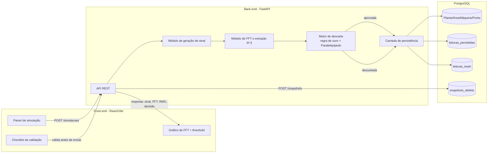
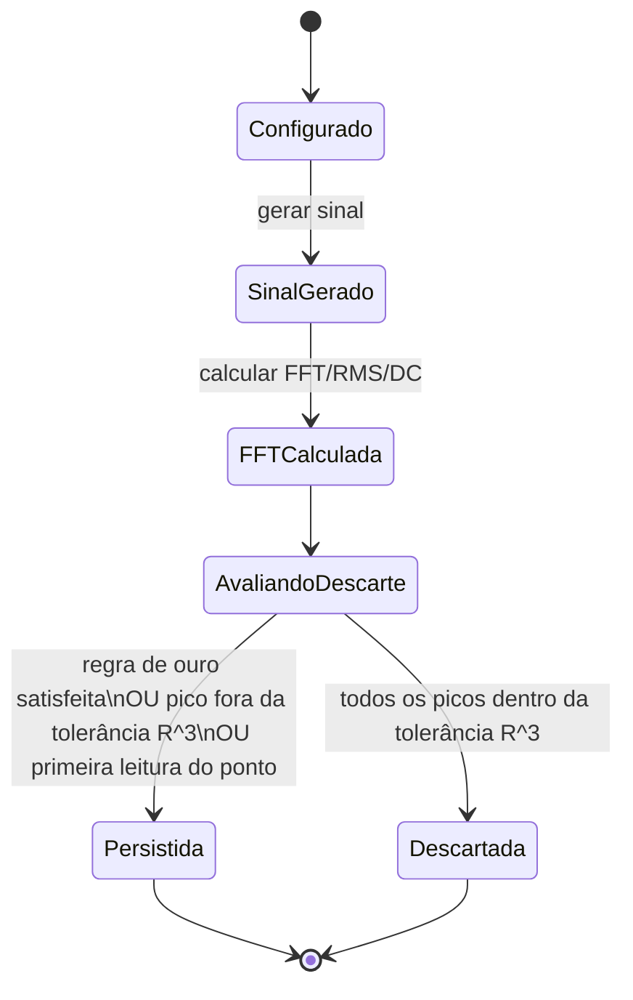

# ARCHITECTURE.md — Arquitetura do Argus

## Visão geral



## Módulos do back-end

| Módulo | Responsabilidade | Requisitos |
|---|---|---|
| `signal_generator` | Gerar sinal sintético no domínio do tempo a partir de RPM, tipo de defeito, severidade e ruído de fundo | `FR-001`–`FR-003` |
| `fft_processor` | Calcular FFT, extrair picos `R^3`, calcular RMS (total/ruído/picos) e valor DC | `FR-004`–`FR-006` |
| `discard_engine` | Aplicar a regra de ouro e o Paralelepípedo de Descarte contra a última leitura persistida por Ponto | `FR-007`–`FR-010` |
| `persistence` | Persistir leituras aprovadas e leituras descartadas, respeitando a hierarquia Planta/Área/Máquina/Ponto | `FR-011`–`FR-013` |
| `api` | Expor endpoints REST de simulação e snapshot, validar entrada (checklist de servidor) | `FR-018`, `NFR-001` |

## Fluxo de dados / máquina de estados (por leitura)



## Schema de dados (visão lógica)

```text
plantas(id, nome)
areas(id, planta_id, nome)
maquinas(id, area_id, nome)
pontos(id, maquina_id, nome, ultima_leitura_persistida_id)

leituras_persistidas(
  id, ponto_id, timestamp_original, rotacao,
  picos_r3 JSONB,          -- lista de {frequencia, amplitude, fase}
  rms_total, rms_ruido, rms_picos, valor_dc,
  nivel_alerta, nivel_shutdown
)

leituras_trash(
  id, ponto_id, timestamp_original, rotacao,
  picos_r3 JSONB, rms_total, rms_ruido, rms_picos, valor_dc,
  motivo_descarte
)

snapshots_defeito(
  id, leitura_id, sensor_id, tipo_defeito, criado_em
)
```

`picos_r3` usa `JSONB` (arquitetura não normalizada, `NFR-003`) para priorizar velocidade de ingestão; consultas analíticas mais complexas podem exigir extração posterior — decisão aceita conscientemente, conforme `docs/descricao.txt`.

## Ownership de transações e estado compartilhado

- `pontos.ultima_leitura_persistida_id` é o estado compartilhado crítico: toda avaliação de descarte lê esse ponteiro dentro da mesma transação que grava a nova leitura, evitando corrida entre simulações concorrentes do mesmo Ponto.
- Cache: nenhum nesta fase (MVP). Se necessário por performance, cache de "última leitura por Ponto" deve ser invalidado na mesma transação de escrita.

## Tratamento de erro e resiliência

- Validação de Nyquist e de parâmetros obrigatórios ocorre antes de qualquer geração de sinal (fail-fast, `NFR-001`, `FR-018`).
- Falha ao persistir uma leitura aprovada não deve alterar `ultima_leitura_persistida_id` (transação atômica).
- Sem retry automático nesta fase; erros retornam `4xx` (entrada inválida) ou `5xx` (falha interna) com mensagem descritiva.

## Segurança

- Nenhuma autenticação nesta fase (`NFR-006`, decisão autônoma). Validação de entrada via schema Pydantic é a única barreira de segurança no MVP.
- Segredos de conexão com banco de dados via variáveis de ambiente, nunca versionados.

## Observabilidade

- Logs estruturados por simulação: parâmetros de entrada, resultado da decisão de descarte, tempo de processamento.
- Métricas agregadas: taxa de descarte (leituras descartadas / leituras avaliadas) e tempo médio de processamento, expostas via endpoint dedicado ou incluídas na resposta da simulação.

## Impacto em performance, custo e compatibilidade

- Geração de sinal e FFT são operações síncronas por requisição; sem processamento em lote no MVP.
- Custo: nenhum custo de infraestrutura além do ambiente local Docker Compose nesta fase.
- Compatibilidade: contrato de API ainda não publicado externamente; mudanças são livres até a primeira versão implementada e validada.

## ADRs

- **ADR-001**: título: Banco de dados relacional com colunas `JSONB` para picos `R^3` | contexto: necessidade de ingestão rápida (`NFR-003`) sem sacrificar consultas por hierarquia | decisão: PostgreSQL + `JSONB`, sem tabela normalizada de picos | consequências: consultas que filtrem por pico individual exigem operadores JSON do Postgres; reavaliar se análises futuras exigirem indexação por frequência.
- **ADR-002**: título: Sem fila de mensagens no MVP | contexto: geração de sinal e persistência são rápidas o suficiente para processamento síncrono | decisão: chamada síncrona request/response via FastAPI | consequências: se volume de simulações concorrentes crescer (`NFR-005`), reavaliar processamento assíncrono.

## Alternativas rejeitadas

- Armazenar cada pico `R^3` como linha própria em tabela normalizada: rejeitado por conflitar com `NFR-003` (prioridade de ingestão sobre conveniência de consulta).
- Processamento assíncrono via fila (Celery/RabbitMQ) desde o início: rejeitado por ausência de necessidade comprovada (anti-bloat, Princípio 7 da constituição).
