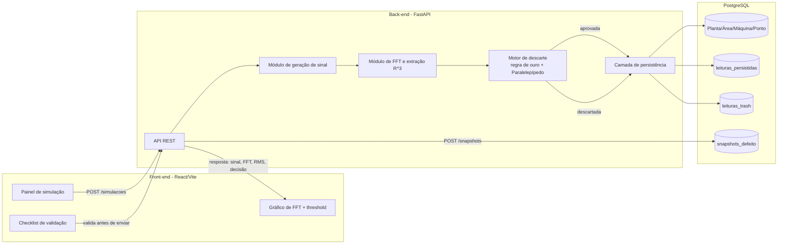
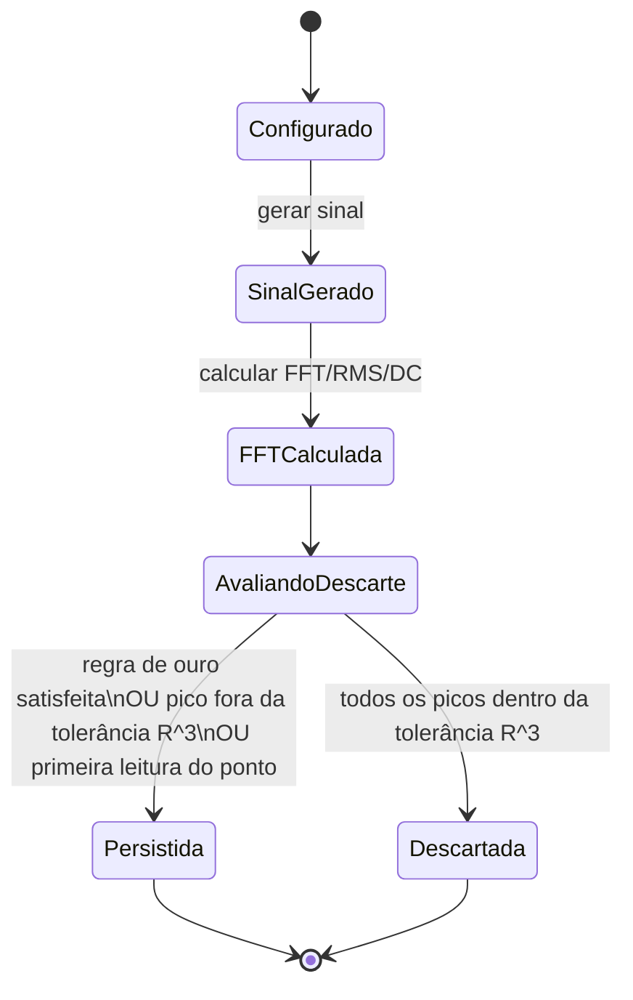
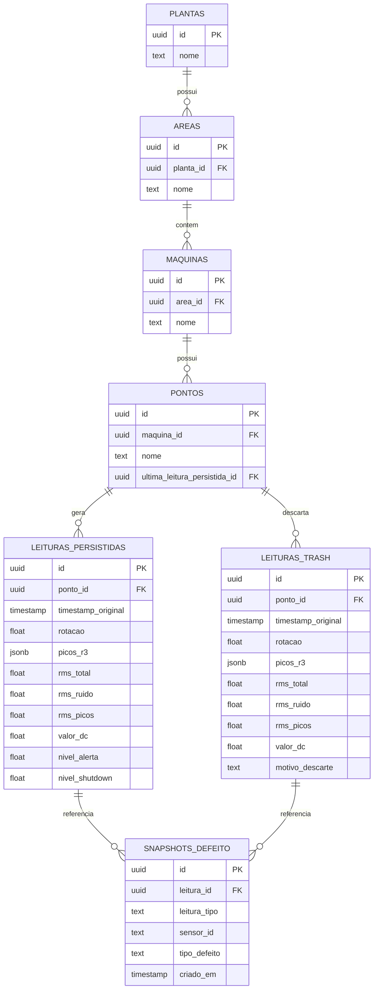
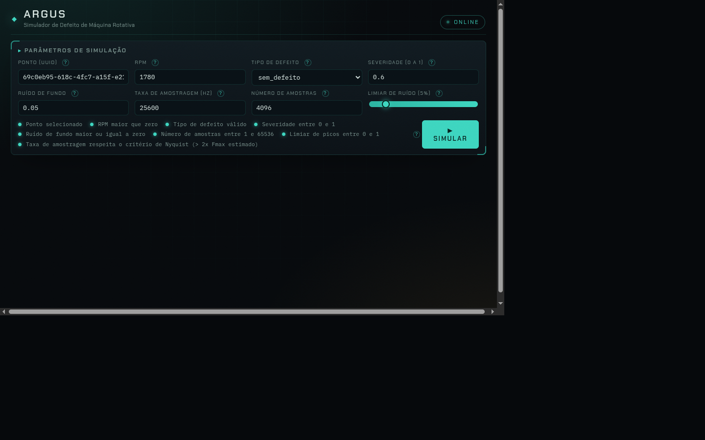
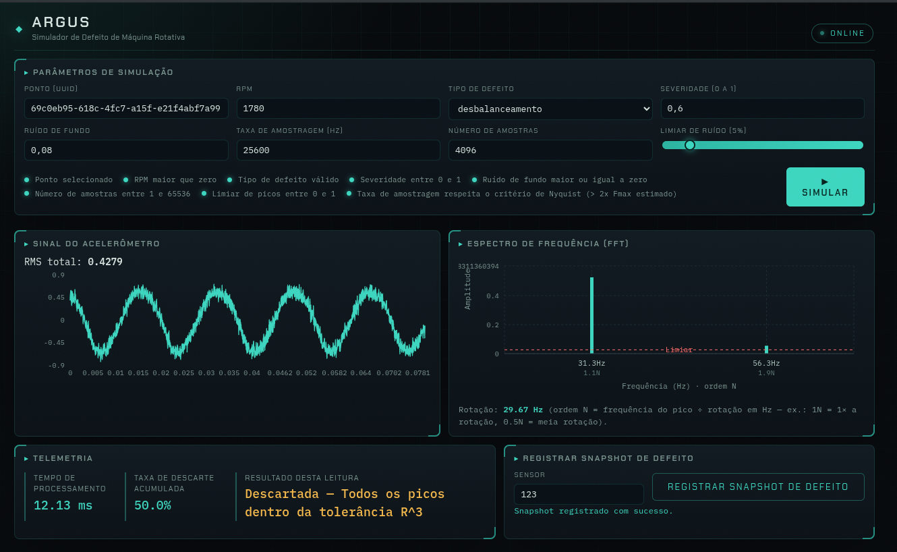
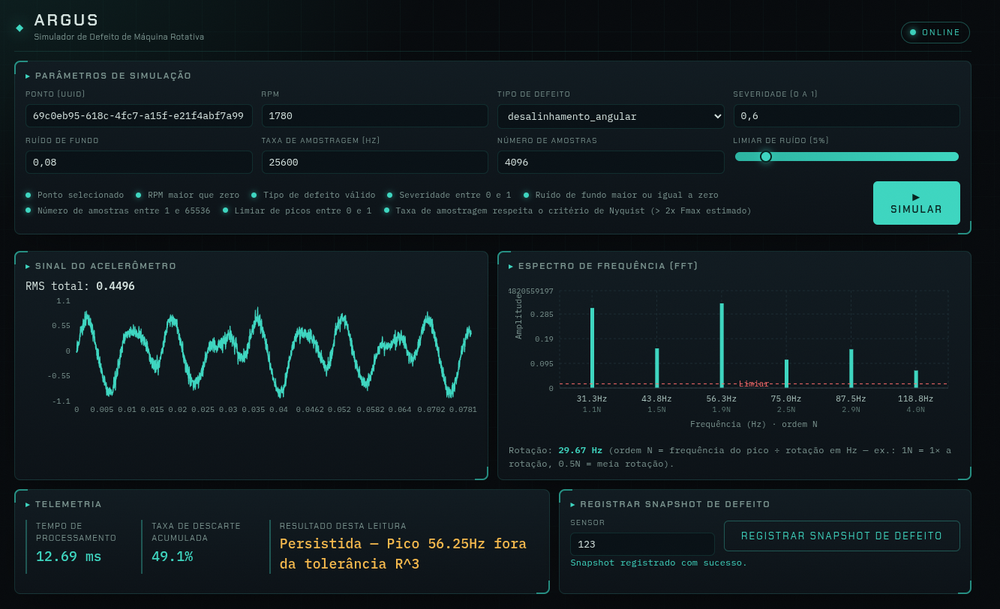
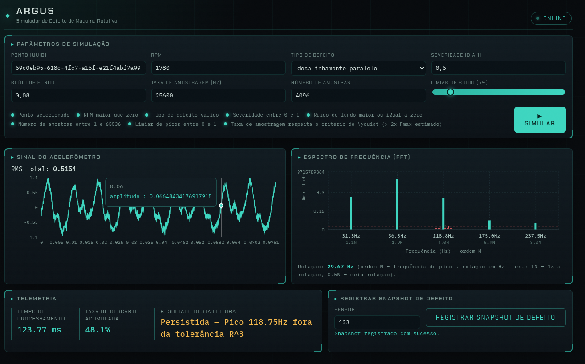
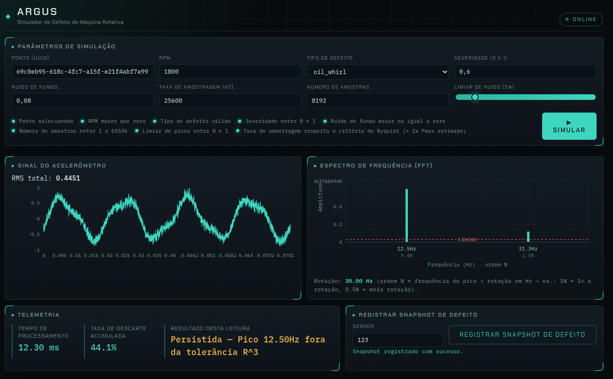
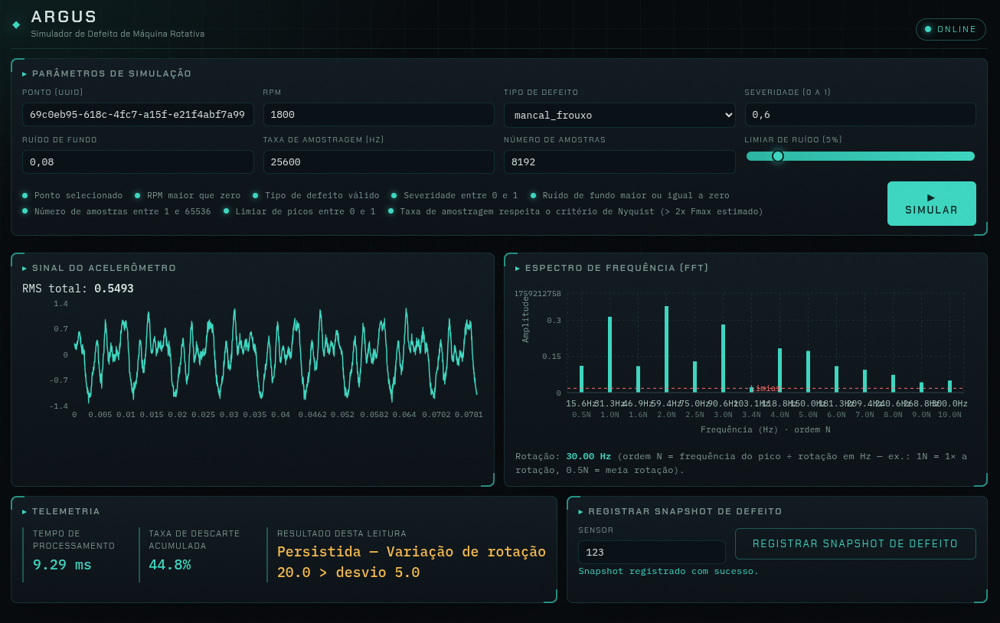
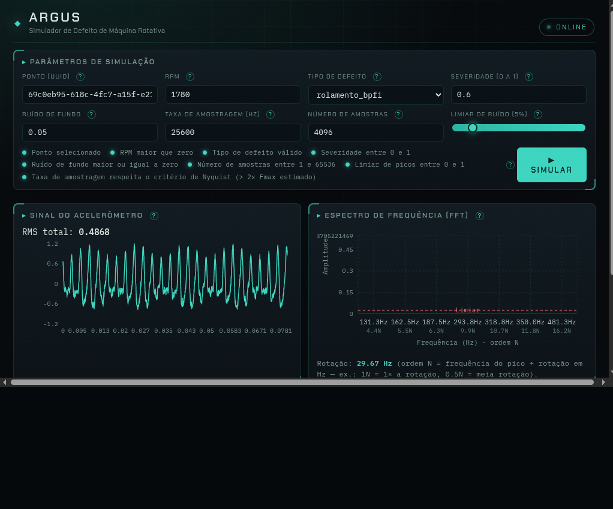

# Argus — Simulador de Defeito de Máquina Rotativa

Simulador de sinais vibracionais sintéticos de máquinas rotativas, usado para testar algoritmos de persistência seletiva (FFT + descarte por similaridade) e para gerar dados de treinamento para análise de causa raiz (RCA) de defeitos mecânicos.

> Estado do projeto: especificação, design e implementação do MVP concluídos (validação `LOCAL` aprovada — ver [STATUS.md](STATUS.md)).

## Objetivo

- Gerar sinais de vibração no domínio do tempo a partir de parâmetros de máquina (RPM, tipo de defeito, severidade, ruído de fundo) e de aquisição (taxa de amostragem, número de amostras).
- Processar o sinal via FFT, extrair picos como vetores `R^3` (frequência, amplitude, fase) e métricas de energia (RMS total, RMS do ruído, RMS dos picos).
- Aplicar persistência seletiva ("Paralelepípedo de Descarte") que decide se cada leitura deve ser armazenada em definitivo ou descartada, reproduzindo o comportamento de um sistema de monitoramento em campo.
- Expor um painel web para configurar simulações, visualizar sinal/FFT/RMS e registrar snapshots de defeito para treinamento/pesquisa.

Detalhes completos de requisitos e critérios de aceitação: [SPECIFICATION.md](SPECIFICATION.md).

## Tecnologias

| Camada | Tecnologia |
|---|---|
| Back-end | Python 3.12, FastAPI, NumPy/SciPy, SQLAlchemy, Alembic |
| Front-end | React 18 + Vite + TypeScript, Recharts |
| Banco de dados | PostgreSQL 16 |
| Execução local | Docker + Docker Compose |

Justificativa e alternativas consideradas: [.specs/codebase/STACK.md](.specs/codebase/STACK.md).

## Arquitetura

### Visão geral (componentes e fluxo de dados)



### Ciclo de vida de uma leitura (máquina de estados)



### Modelo de dados (entidades e relacionamentos)



> `snapshots_defeito.leitura_id` é polimórfico: aponta para `leituras_persistidas` ou `leituras_trash` (campo `leitura_tipo` indica qual). Detalhes em [.specs/codebase/ARCHITECTURE.md](.specs/codebase/ARCHITECTURE.md).

## Requisitos

- Docker e Docker Compose instalados.
- Para desenvolvimento sem contêiner: Python 3.12+ e Node.js 20+.

## Como executar (ambiente local via Docker Compose)

```bash
# Subir banco de dados, back-end e front-end (o back-end roda as migrações no start)
docker compose up --build

# Painel web: http://localhost:5173  |  API: http://localhost:8000  |  Docs OpenAPI: http://localhost:8000/docs
```

> Para usar o painel é necessário existir um Ponto na hierarquia Planta > Área > Máquina > Ponto (a API não expõe endpoint de cadastro no MVP). Crie um ponto de exemplo no banco:
>
> ```bash
> docker compose exec db psql -U argus -d argus -c \
>   "WITH p AS (INSERT INTO plantas(id,nome) VALUES (gen_random_uuid(),'Planta Demo') RETURNING id), \
>          a AS (INSERT INTO areas(id,planta_id,nome) SELECT gen_random_uuid(), id, 'Área Demo' FROM p RETURNING id), \
>          m AS (INSERT INTO maquinas(id,area_id,nome) SELECT gen_random_uuid(), id, 'Máquina Demo' FROM a RETURNING id) \
>   INSERT INTO pontos(id,maquina_id,nome) SELECT gen_random_uuid(), id, 'Ponto Demo' FROM m RETURNING id;"
> ```

### Desenvolvimento sem contêiner

```bash
# Back-end (na raiz de backend/)
python3 -m venv .venv && source .venv/bin/activate
pip install -r requirements-dev.txt
alembic upgrade head              # aplica migrações
uvicorn app.main:app --reload     # http://localhost:8000

# Front-end (na raiz de frontend/, o Vite faz proxy de /api -> localhost:8000)
npm install
npm run dev                       # http://localhost:5173
```

### Testes

```bash
# Back-end (na raiz de backend/, com .venv ativo)
ruff check app tests && mypy app && python -m pytest        # 49 testes (unit + integração + contrato)

# Front-end (na raiz de frontend/)
npx tsc -b && npx oxlint && npx vitest run                 # 9 testes
```

### Parar o ambiente

```bash
docker compose down            # remove os contêineres (mantém o volume do banco)
docker compose down -v         # remove também o volume (apaga os dados)
```

## Estrutura de diretórios

```text
.
├── docs/                         # Documentos de origem + capturas do dashboard (docs/imagens/)
├── .specs/                       # Especificação técnica detalhada (SDD)
│   ├── project/                  # Constituição e roadmap do projeto
│   ├── codebase/                 # Stack, arquitetura, convenções e testes
│   └── features/simulador-vibracao/  # design.md, tasks.md e context.md do MVP
├── backend/                    # API FastAPI (domain, persistence, api, alembic, tests)
├── frontend/                   # SPA React + Vite + Recharts (componentes e testes)
├── docker-compose.yml          # serviços db (Postgres 16), backend, frontend (nginx)
├── .env.example                # referência de variáveis de ambiente
├── SPECIFICATION.md              # Especificação funcional e técnica do sistema
├── AGENTS.md                     # Regras permanentes para agentes que alterarem este repositório
├── STATUS.md                     # Estado atual do desenvolvimento
└── HANDOFF.md                    # Transferência de contexto entre agentes
```

## Capturas de tela (dashboard)

Painel web do simulador (imagens em `docs/imagens/`).



### Exemplos de assinaturas espectrais













## Documentação técnica

- Especificação: [SPECIFICATION.md](SPECIFICATION.md)
- Constituição do projeto: [.specs/project/constitution.md](.specs/project/constitution.md)
- Roadmap: [.specs/project/ROADMAP.md](.specs/project/ROADMAP.md)
- Design do MVP: [.specs/features/simulador-vibracao/design.md](.specs/features/simulador-vibracao/design.md)
- Tarefas do MVP: [.specs/features/simulador-vibracao/tasks.md](.specs/features/simulador-vibracao/tasks.md)
- Critérios técnicos de origem (domínio de vibração): [docs/descricao.txt](docs/descricao.txt), [docs/criterioArmazenamento.txt](docs/criterioArmazenamento.txt), [docs/criterioDetermincacaoAnamalia.txt](docs/criterioDetermincacaoAnamalia.txt)

## Licença

Este projeto é distribuído sob a [Apache License 2.0](LICENSE).
